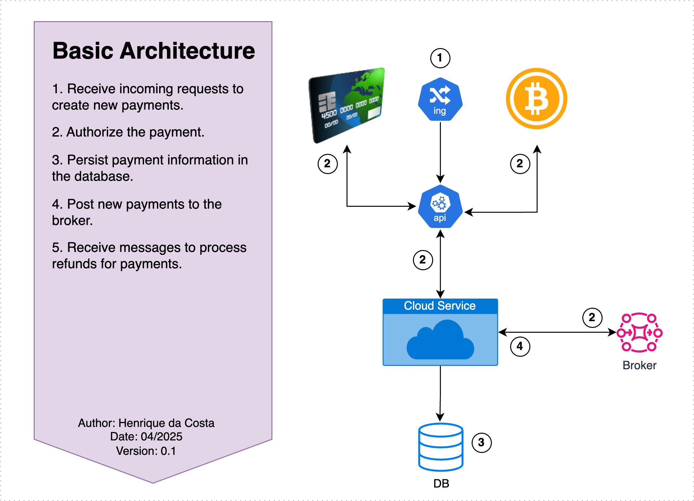

# java-arch-patterns

> Quarkus Architecture Patterns Playground.

A demonstration project showcasing various backend architecture patterns implemented with Quarkus, designed to help
developers understand different architectural approaches in modern Java applications.

## Architecture Patterns

- **[Hexagonal Architecture](docs/hexagonal.md)**

## Architecture of the Examples

All architectural patterns are based on the same core features. The only difference lies in how the classes and
responsibilities are distributed.



# Wiremock for local test

Run the wiremock standalone server with the following command:

```shell
cd wire_mock

java -jar wiremock-standalone-3.12.1.jar --port 8082
```

> Use the final credit card number `1111` for success and `2222` to failure in the credit card transactions. 

> Use the walletId `1111` for success and `2222` to failure in the wallet transactions.

# Quarkus Infos

This project uses Quarkus, the Supersonic Subatomic Java Framework.

If you want to learn more about Quarkus, please visit its website: <https://quarkus.io/>.

## Running the application in dev mode

You can run your application in dev mode that enables live coding using:

```shell script
./gradlew quarkusDev
```

> **_NOTE:_**  Quarkus now ships with a Dev UI, which is available in dev mode only at <http://localhost:8080/q/dev/>.

## Packaging and running the application

The application can be packaged using:

```shell script
./gradlew build
```

It produces the `quarkus-run.jar` file in the `build/quarkus-app/` directory.
Be aware that it’s not an _über-jar_ as the dependencies are copied into the `build/quarkus-app/lib/` directory.

The application is now runnable using `java -jar build/quarkus-app/quarkus-run.jar`.

If you want to build an _über-jar_, execute the following command:

```shell script
./gradlew build -Dquarkus.package.jar.type=uber-jar
```

The application, packaged as an _über-jar_, is now runnable using `java -jar build/*-runner.jar`.

## Creating a native executable

You can create a native executable using:

```shell script
./gradlew build -Dquarkus.native.enabled=true
```

Or, if you don't have GraalVM installed, you can run the native executable build in a container using:

```shell script
./gradlew build -Dquarkus.native.enabled=true -Dquarkus.native.container-build=true
```

You can then execute your native executable with: `./build/java-arch-patterns-1.0.0-SNAPSHOT-runner`

If you want to learn more about building native executables, please consult <https://quarkus.io/guides/gradle-tooling>.

## Provided Code

### REST

Easily start your REST Web Services

[Related guide section...](https://quarkus.io/guides/getting-started-reactive#reactive-jax-rs-resources)
